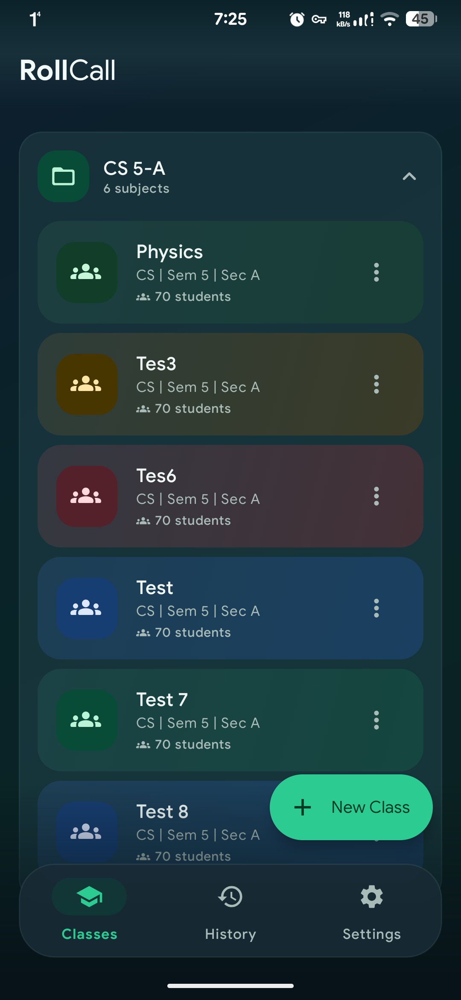
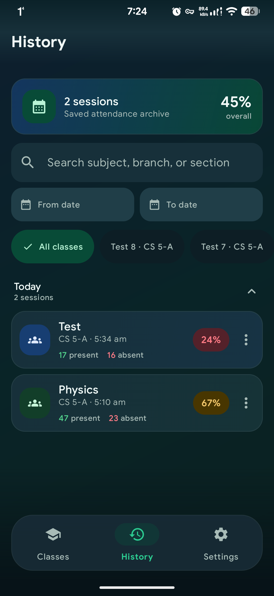
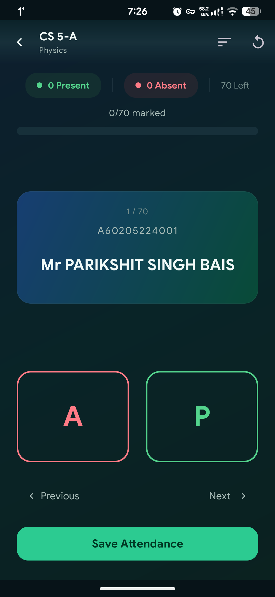
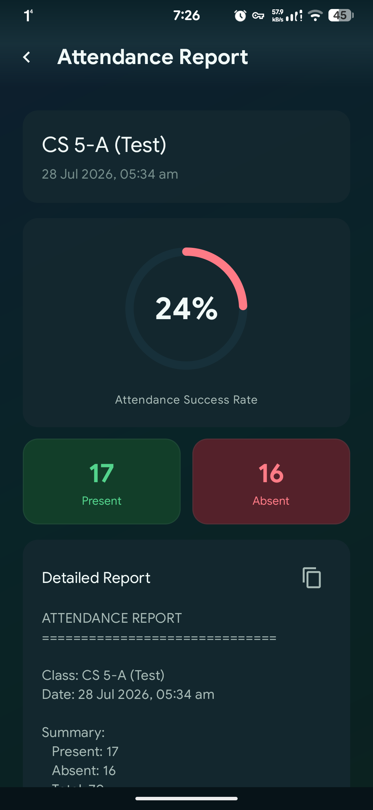
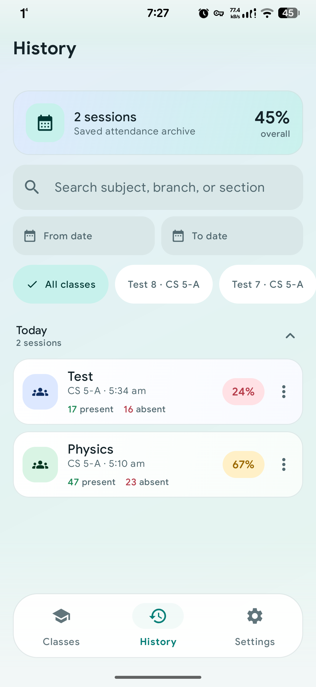
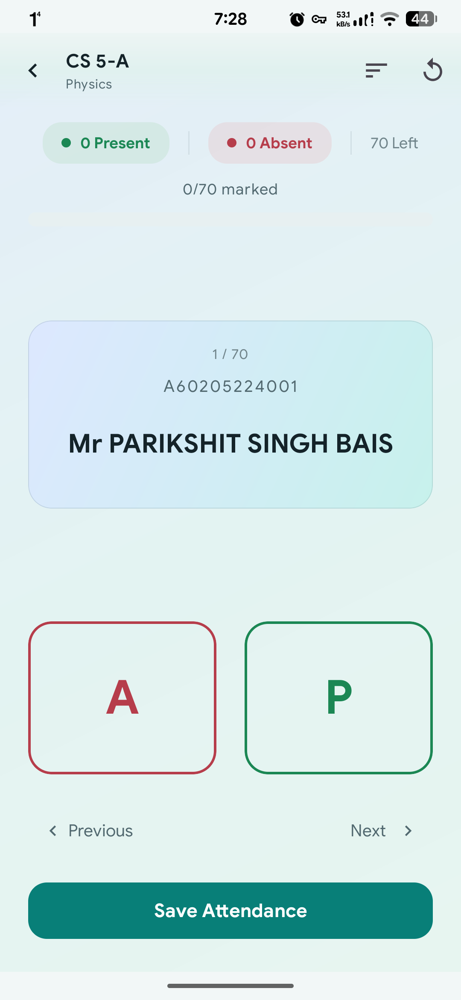
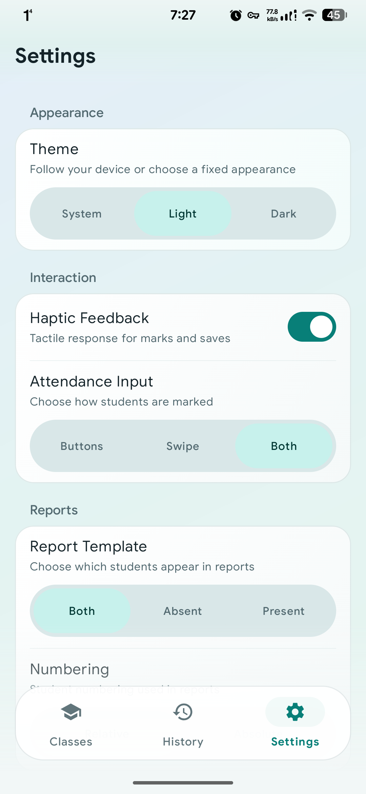

<p align="center">
  
</p>

<h1 align="center">RollCall</h1>

<p align="center">
  A fast, private attendance app for Android with modern motion, focused workflows,
  searchable history, and shareable reports.
</p>

<p align="center">
  
  
  
  
  <a href="LICENSE"></a>
</p>

## Overview

RollCall is designed for teachers, lecturers, and group coordinators who need to
take attendance quickly without creating an account or sending student data to a
server. Classes, rosters, sessions, settings, and reports stay on the device.

Version 3.0 introduces a complete visual refresh with light, dark, and system
themes; filled class accents; spring-based interaction feedback; continuous
edge-to-edge headers; a floating navigation dock; and a much more capable
attendance archive.

## Screenshots

<p align="center">
  
  
  
  
</p>

<p align="center">
  
  
  
</p>

## Highlights

### Class and roster management

- Group related subjects by branch, semester, and section.
- Distinguish subjects with consistent color-filled cards.
- Create, edit, duplicate, and delete classes.
- Import names and optional roll numbers from CSV files.
- Preserve historical attendance when a roster is edited.

### Fast attendance

- Mark Present or Absent with large buttons, swipe gestures, or both.
- Get immediate filled-card confirmation and optional haptic feedback.
- Review previous and next students without losing progress.
- Track present, absent, remaining, and completion counts live.
- Sort the roster or reset the current session when needed.

### Useful history

- Search by subject, branch, or section.
- Filter by class and start/end date.
- Browse sessions grouped by day.
- Open a session for its complete report or safely delete it.
- See attendance rates and present/absent counts at a glance.

### Reports and sharing

- View a percentage gauge and session summary.
- Inspect a detailed text report.
- Copy the report to the clipboard.
- Share the summary as plain text or a generated PNG card.

### Modern, accessible interface

- Light, Dark, and Follow System appearance modes.
- Teal interaction accents with class-specific blue, green, amber, and red tones.
- Spring presses, hero-style screen transitions, and reduced visual clutter.
- Consistent rounded surfaces, readable contrast, and 48 dp touch targets.
- Configurable haptics, attendance input mode, report template, and numbering.

## Privacy

RollCall is offline-first:

- No account is required.
- No ads or analytics are included.
- No tracking SDK is included.
- No internet permission is declared.
- Attendance data is stored locally with Room.
- Preferences are stored locally with DataStore.

| Permission | Reason |
| --- | --- |
| `VIBRATE` | Optional haptic confirmation |
| `READ_EXTERNAL_STORAGE` on Android 12 and older | Legacy compatibility for selecting roster CSV files |

## Technology

| Area | Implementation |
| --- | --- |
| Language | Kotlin |
| UI | Jetpack Compose and Material 3 Views |
| Architecture | MVVM with StateFlow |
| Persistence | Room database |
| Preferences | DataStore |
| Dependency injection | Hilt |
| Async work | Kotlin Coroutines |
| Minimum Android version | Android 7.0 / API 24 |
| Target SDK | API 34 |

The app currently uses a pragmatic Compose-and-Views architecture while the UI
migration continues. Shared colors, shapes, motion, and spacing keep both layers
visually consistent.

## Install

Download an APK from the
[GitHub Releases](https://github.com/sillypari/RollCall/releases) page, then allow
installation from your chosen file manager when Android asks.

## Build from source

### Requirements

- Android Studio with Android SDK 34
- JDK 17
- An Android 7.0 or newer device or emulator

```bash
git clone https://github.com/sillypari/RollCall.git
cd RollCall
./gradlew assembleDebug
```

On Windows PowerShell:

```powershell
git clone https://github.com/sillypari/RollCall.git
Set-Location RollCall
.\gradlew.bat assembleDebug
```

The universal debug APK is generated at:

```text
app/build/outputs/apk/debug/app-universal-debug.apk
```

Install it on a connected device:

```bash
adb install -r app/build/outputs/apk/debug/app-universal-debug.apk
```

Run the static Android checks:

```bash
./gradlew lintDebug
```

## CSV roster format

RollCall accepts either a two-column roster:

```csv
Roll No,Name
101,Alex Morgan
102,Sam Rivera
```

or a single name column:

```csv
Name
Alex Morgan
Sam Rivera
```

Header rows are detected automatically and empty rows are ignored.

## Contributing

Issues and pull requests are welcome.

1. Fork the repository.
2. Create a focused branch: `git checkout -b feature/short-description`.
3. Build and run lint before committing.
4. Open a pull request describing the user-facing change and verification.

Use the existing Material icons and design tokens for interface additions. Do
not use emoji characters as application icons.

## License

RollCall is available under the [MIT License](LICENSE).

<p align="center">
  <strong>Simple attendance. Private by default.</strong>
</p>
